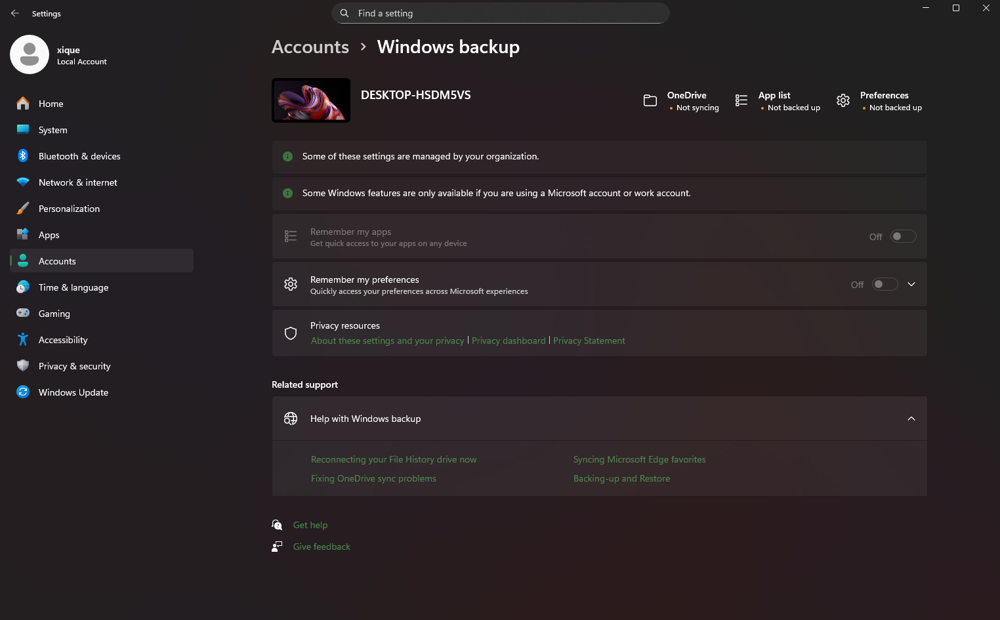
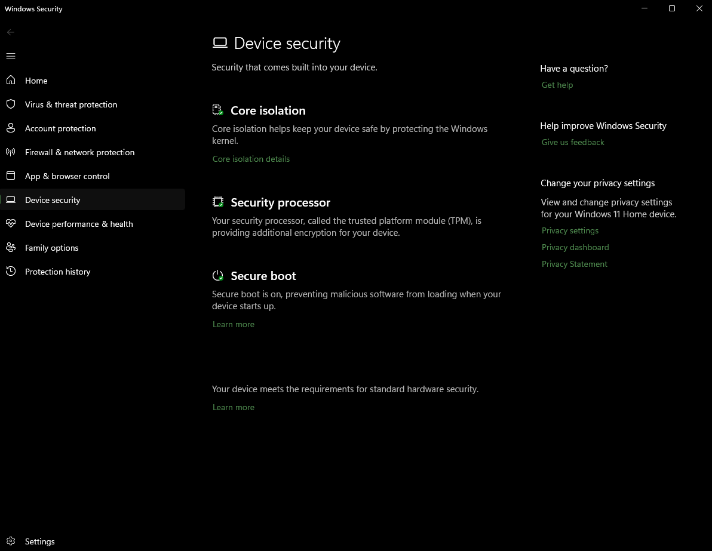

## 🛡️ Parte A — Definição da Política

### **Política de Senha**

* Mínimo: **10 caracteres**
* Complexidade: maiúsculas, minúsculas, números e caractere especial
* Expiração: **60 dias**
* Histórico: **5 senhas anteriores**

### **Autenticação**

* Login individual
* **2FA obrigatório** para VPN e e-mail
* Bloqueio após **5 tentativas falhas**

### **Controle de Permissões**

* Uso de grupos (Administradores, Usuários, Financeiro, TI etc.)
* Permissões configuradas via **ACL**, seguindo o princípio do menor privilégio

### **Acesso Externo**

* Acesso remoto só via **VPN**
* RDP restrito por IP autorizado
* NAT configurado para evitar portas expostas

### **Firewall e Proxy**

* Firewall do Windows ativo em todos os perfis
* Liberação de portas apenas quando houver necessidade real
* Proxy opcional para filtrar navegação

### **Antivírus/Antimalware**

* Uso do **Microsoft Defender**
* Atualizações automáticas
* Scan completo semanal

### **Controle de Portas**

* Portas não utilizadas ficam bloqueadas
* Regras específicas criadas para serviços internos

### **Backup**

* Backup **diário** utilizando Histórico de Arquivos
* Armazenamento em mídia externa/servidor
* Teste de restauração mensal

### **Criptografia**

* **BitLocker** habilitado em máquinas com dados sensíveis
* Certificados digitais em operações específicas

### **Treinamento de Usuários**

* Alertas sobre phishing, engenharia social e segurança básica
* Sessões rápidas trimestrais

---

# 🖥️ Parte B — Configuração no Windows (Laboratório)

> **Nota:** Os prints foram feitos no **Windows Home**, então algumas telas e opções podem variar um pouco.

#### **1. Ajuste de senha de usuário**

#### **2. Backup**

#### **3. Criptografia**

#### **4. Permissões de pastas**

#### **5. Proteção contra vírus (Defender)**

#### **6. Regras de entrada (Firewall)**

#### **7. Regras de saída (Firewall)**

#### **8. Senha e autenticação**

## 📝 Parte C — Conclusão

A política configurada trouxe um ambiente consistente e bem protegido. Os maiores pontos fortes foram a clareza nas permissões, firewall ajustado e backup funcionando.
Limitações existem, principalmente por ser um laboratório e não incluir AD completo ou 2FA corporativo real, mas o ambiente final ficou sólido e pronto pra uso.

---

## 🏢 Parte D — Desafio (Empresa Fictícia — “Malenia & Radahn Soluções Corporativas”)

### **Cenário da Empresa**

A "Malenia & Radahn Soluções Corporativas" é uma empresa de **20 funcionários** que trabalha com suporte básico e serviços administrativos.
Eles **fazem só o mínimo** na segurança:

* Senha padrão “eldenring123”
* Antivírus instalado, mas cada um atualiza quando lembra
* Firewall no modo padrão
* Backup “quando dá tempo”
* Nenhum treinamento de segurança

### **Vulnerabilidades Encontradas**

* Reutilização de senha em 100% dos funcionários
* Falta total de 2FA
* Portas expostas por uso incorreto do RDP
* Backups sem teste de restauração
* Defender desatualizado em várias máquinas
* Falta de criptografia nos notebooks
* Funcionários clicando em link de “parcelado sem juros” sem pensar duas vezes

### **Melhorias Propostas**

* Política de senha forte, com expiração e histórico
* 2FA obrigatório para VPN, e-mail e acesso administrativo
* BitLocker habilitado em todos os notebooks
* Firewall revisado com regras específicas
* Backup diário com monitoramento automático
* Treinamento trimestral (curto, direto, mas eficiente)
* Atualizações automáticas forçadas no Microsoft Defender
* Desativar RDP aberto para internet e mover acesso remoto para VPN

### **Resumo do Diagnóstico**

A empresa estava vulnerável por falta de regras e costume de “depois a gente vê isso”.
Após aplicar as melhorias sugeridas, o ambiente ficou bem mais seguro, reduzindo risco de ataques, perda de dados e problemas gerados por usuários desatentos.

---
